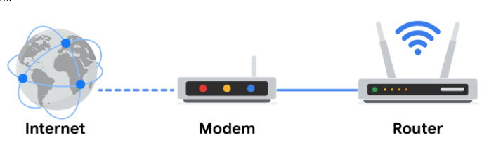
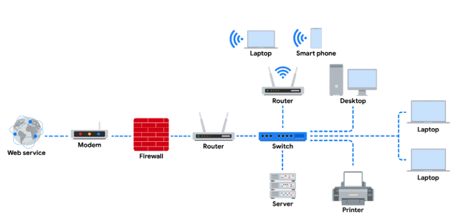
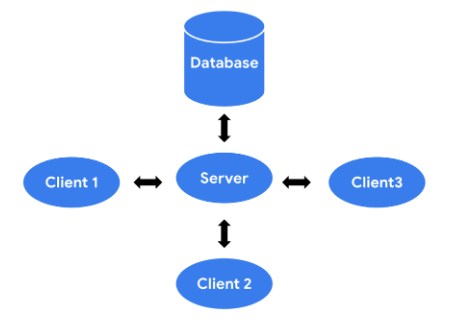
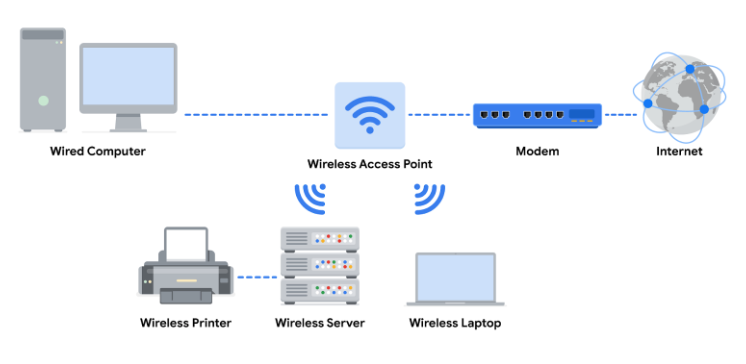

# Herramientas de red

Los dispositivos de red mantienen información y servicios para los usuarios de una red. Estos dispositivos se conectan a través de conexiones cableadas e inalámbricas. Tras establecer una conexión con la red, los dispositivos envían paquetes de datos. Los paquetes de datos proporcionan información sobre el origen y el destino de los datos. Así es como se envía y recibe la información a través de los distintos dispositivos de una red.

En este apartado vamos a ver los distintos componentes físicos que forman una red:

- **Hub (Concentrador):** Dispositivo que emite información a todos los dispositivos de la red. Repiten toda la información a todos los puertos pero esto hace que sean muy vulnerables a las escuchas. Por ello no es muy recomendable usarlos en organizaciones.

- **Switch (Conmutador):** Establece conexiones entre dispositivos específicos de una red enviando y recibiendo datos (paquetes) entre ellos. Solo transmite datos al destino previsto y por ello, hace que los switch sean más seguros que un hub ya que les permite controlar el flujo de tráfico y mejorar el rendimiento de la red. Usa direcciones MAC para identificar los dispositivos de destino. Forma parte de la capa de vínculo de datos en el modelo TCP/IP.

- **Router:** Conecta varias redes entre sí y dirigen el tráfico, basándose en las direcciones IP de la red de destino. Permiten que los dispositivos de distintas redes se comuniquen entre ellos. La dirección IP de la red de destino está contenida en la cabecera IP, entonces el router lee la información de la cabecera IP i reenvía el paquete al siguiente router. Este proceso sigue hasta que el paquete llega a su destino final. Forma parte de la capa de red en el modelo TCP/IP.

- **Módems:** Conecta una LAN con un proveedor de servicios de Internet (ISP). Los ISP proporcionan conexión a Internet a través de líneas telefónicas, los módems reciben las señales digitales de Internet y las convierten en un formato digital compatible con la conexión física (Linea telefóncia o fibra óptica) que le proporciona su ISP. Normalmente, los módems se conectan a un router que tomará estas señales y las enviará a una red local.

  

  

Todos estos dispositivos físicos pueden ser completados por herramientas de virtualización. 

- **Herramientas de virtualización:** Piezas de software que realizan operaciones de red y que llevan a cabo tareas que haría un dispositivo físico de los mencionados anteriormente. Normalmente son ofrecidas por los proveedores de servicio en la nube. Ofrecen ahorro de costes y mayor escalabilidad. 

En la red también podemos encontrar otros dispositivos que debemos tener en cuenta y saber como se desempeñan:

- **Cortafuegos:** Es un dispositivo de seguridad de red que controla el tráfico hacio o desde su red y puede restringir el tráfico de red específico que entra y sale. Suele ser la primera línea de defensa que hay y se situa entre la red interna segura y los recursos de red no fiables fuera de la organización, como Internet.

- **Servidores:** Proporcionan información y servicios para todos los dispositivos que se conectan a él, también conocidos como clientes. Un ejemplo muy conocido es el modelo cliente-servidor. Los clientes envian peticiones de información y servicios al servidor y este, realiza las peticiones a la BBDD para los clientes. 

  

- **Punto de acceso inalámbrico:** Envía y recibe señales digitales a través de ondas de radio creando una red inalámbrica. Los dispositivos con adaptadores inalámbricos se conectan al punto de acceso mediante Wi-Fi. **Wi-Fi** hace referencia a un conjunto de estándares que utilizan los dispositivos de red para comunicarse de forma inalámbrica y enviar datos a través de ondas de radio. 

  

### Diagramas de red

Los diagramas de red son mapas que muestran los dispositivos de una red y cómo se conectan. Utilizan pequeños gráficos para representar cada dispositivo de la red y líneas de puntos para mostrar cómo se conectan entre ellos. Mediante su estudio, los analistas desarrollan y perfeccionan sus estrategias para proteger las arquitecturas de red.

  

