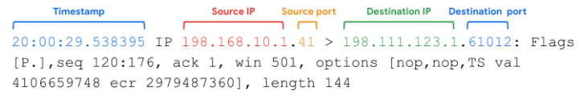

# Analizador de protocolos de red

Un analizador de paquetes o sniffer es una herramienta diseñada para capturar y analizar el tráfico de datos dentro de una red. Suelen usarse para investigar, monitorizar redes y identificar actividades sospechosas. Hay bastante variedad, como por ejemplo WireShark o tcpdump. Por ahora nos centraremos en tcpdump. 
 

## Tcpdump

Es un sniffer de paquetes de línea de comandos. Proporciona un breve análisis de paquetes y convierte la información clave sobre el tráfico de red en formatos fácilmente legibles. Muestra la dirección IP de origen, las direcciones IP de destino y los números de puertos que se están utilizando en las comunicaciones. 

### Interpretar la salida

La salida de una captura de paquetes contiene mucha información sobre el tráfico de red. Un ejemplo sería la imagen que hay a continuación.

  

Una captura de paquetes incluye: 

- **Marca de tiempo:** La salida comienza con la marca de tiempo formateada como horas, minutos, segundos y fracciones de segundo.
- **IP de origen:** El origen del paquete lo proporciona su dirección IP de origen. 
- **Puerto de origen:** Este número de puerto es dónde se originó el paquete.
- **IP de destino:** La dirección IP de destino hacia dónde se dirige el paquete.
- **Puerto de destino:** Este número de puerto es hacia dónde se está dirigiendo el paquete.

### Usos comunes

Habitualmente se usan para capturar y visualizar las comunicaciones de red y recopilar estadísticas sobre ella pero también se pueden usar para:

- Detectar e identificar el tráfico malicioso.
- Crear alertas personalizadas para enviar notificaciones cuando surjan problemas o amenazas en la red.
- Localizar la mensajería instantánea, el tráfico o los puntos de acceso inalámbricos no autorizados. 