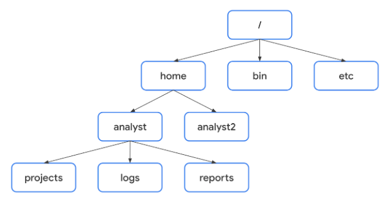

# Navegar por Linux y leer el contenido de los archivos

### Estándar de jerarquía del sistema de archivos (FHS)

Es el componente de Linux que organiza los datos. Es importante porque define cómo se organizan los directorios, el contenido de los directorios y otros tipos de almacenamiento en el SO.

  

 

Una ruta de archivo es la ubicación de un archivo o directorio. En esta ruta, los distintos niveles de la jerarquía están separados por una barra /.

- **Directorio raíz:** Es el directorio de más alto nivel en Linux y se representa con una /. Todos los subdirectorios se ramifican a partir del directorio raíz.

- **Directorios FHS estándar:** Justo debajo del directorio raíz están los directorios FHS estándar. Algunos ejemplos son los siguientes:

    - **/home:** Cada usuario del sistema tiene su propio directorio personal.
    - **/bin:** Significa binario y contiene archivos binarios y otros ejecutables.
    - **/etc:** Directorio que almacena los archivos de configuración del sistema.
    - **/tmp:** Almacena muchos archivos temporales. Es utilizado habitualmente por los atacantes porque cualquier persona del sistema puede modificar los datos de estos archivos.
    - **/mnt:** Significa montar y almacena soportes, como unidades USB y discos duros.

- **Subdirectorios específicos de usuario:** Bajo /home hay subdirectorios para usuarios específicos y, cada usuario, tendrá sus propios subdirectorios. 

    - **Ruta de archivo absoluta:** Es la ruta de archivo completa, que parte de la raíz. 
    - **Ruta de archivo relativa:** Es la ruta que parte del directorio actual de un usuario. 
 

### Comandos clave para navegar por el sistema de archivos

- **pwd:** Imprime en pantalla el directorio de trabajo. La salida proporciona la ruta de acceso absoluta a este directorio.
- **ls:** Muestra los nombres de los archivos y directorios del directorio de trabajo actual. 
- **cd:** Navega entre directorios.
 

### Comandos comunes para leer el contenido de los archivos

- **cat:** Muestra el contenido de un archivo.
- **head:** Muestra sólo el principio de un archivo, por defecto son 10 líneas. Puede ser útil cuando desea conocer el contenido básico de un archivo pero no necesita el contenido completo.
- **tail:** Muestra sólo las últimas líneas de un archivo, por defecto son 10 líneas también.
- **less:** Devuelve el contenido de un archivo página a página.