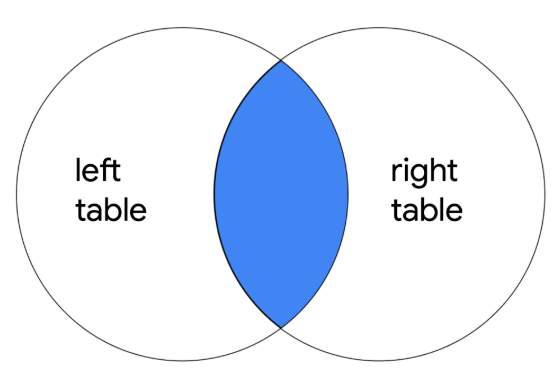
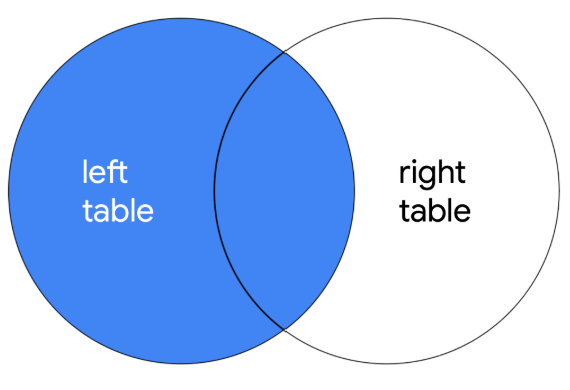
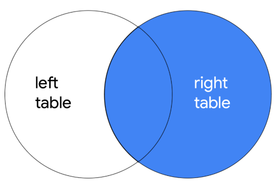
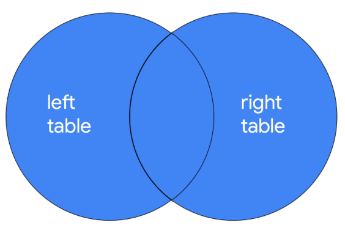

# Unir tablas en SQL

Unir tablas resulta útil cuando necesitamos información de dos tablas diferentes en una base de datos. En las sentencias SQL necesitamos saber a que columna nos estamos refiriendo y para resolverlo, se hace escribiendo primero el nombre de la tabla, luego un punto y finalmente el nombre de la columna. Para hacer esta unión, primero tenemos que identificar la columna compartida que las une. Seguidamente, usaremos el tipo de unión que se llama INNER JOIN.

- **INNER JOIN:** Devuelve filas que coinciden en una columna específica en más de una tabla.

  

*Ejemplo:* SELECT username, office, operating_system
FROM employees
INNER JOIN machines ON employees.employee_id = machines.employee_id;

Una vez visto esto, es probable que en algunas situaciones necesitemos todas las entradas de una o ambas tablas. Es por ello que vamos a tener que usar uniones externas como: LEFT JOIN, RIGHT JOIN y FULL OUTER JOIN. Son similares a las uniones internas pero estas no necesitan necesariamente una coincidencia entre columnas para devolver una fila.

- **LEFT JOIN:** Devuelve todas las filas de la tabla de la izquierda y las filas coincidentes de la tabla de la derecha. Los registros que no coinciden con el JOIN contendrán valores nulos.

  

- **RIGHT JOIN:** Devuelve todas las filas de la tabla de la derecha y las filas coincidentes de la tabla de la izquierda. Los registros que no coinciden con el JOIN contendrán valores nulos.

  

- **FULL OUTER JOIN:** Devuelve todos los registros de ambas tablas.

  

La sintaxis que se usa es la misma que la del INNER JOIN.